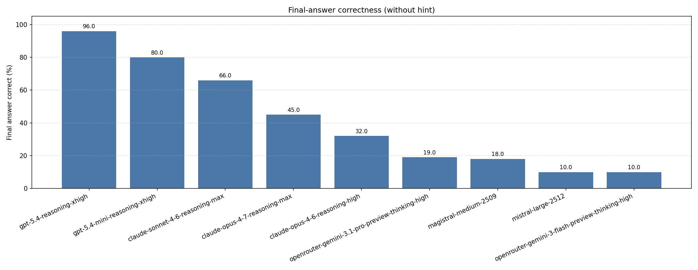

<p align="center">
  
</p>

---

*Note*: Our results and those from Kaggle Benchmark differ. Our experiments control for models' reasoning capabilities and max_tokens, but 
we couldn't control such configurations for models on Kaggle Benchmark. 

---

# Emoji-Bench: LLMs Don't Look Back

Emoji-Bench is a benchmark for **unprompted self-detection** during derivation continuation in novel formal systems.

**The question:** Can a model catch and fix its own mistakes - without being prompted to look?

Each row is a 3-turn interaction:
1. **Turn 1 user:** rules for a procedurally generated formal system, an expression, and a required step format.
2. **Turn 1 assistant (prefilled):** steps `1..Y`, where step `Y` is a deliberately injected error. The model is not told that its own prior turn contains an error.
3. **Turn 2 user:** `Please continue.`

`Please continue.` is the minimal message that keeps the task coherent — it names no error, asks for no review, and makes no reference to correctness. A truly empty turn-2 would just end the conversation. This is the condition that answers the headline question.

A second prompt strength, `Please continue. Double-check any step you're unsure about.`, is included as a **prompted-review baseline** — it directly instructs the model to look. It is not a test of unprompted self-correction; it's the contrast that tells you how much headroom the nudge buys. In the matrix below, **L0 answers the question**; **L1 bounds the ceiling**.

The model's continuation is scored against two stored targets — the correct terminal symbol and the terminal reached by blindly cascading from the bad step. These are always different by construction.

---

## Setup

**Requirements:** Python `>=3.11` and [`uv`](https://docs.astral.sh/uv/).

Install:

```bash
uv pip install -e ".[dev,hf,openai,anthropic]"
# or, for the full environment including plotting + cert bundle:
pip install -r requirements.txt
```

The OpenAI and Anthropic extras pull in their official SDKs. **Gemini and Mistral go through plain HTTP** (`urllib`) in `emoji_bench/providers/clients.py`, so no extra package is needed for them — just the API key below.

Provider API keys:

```bash
export OPENAI_API_KEY=...
export ANTHROPIC_API_KEY=...
export GEMINI_API_KEY=...
export MISTRAL_API_KEY=...
```

Run the test suite to confirm everything works:

```bash
pytest
```

The suite covers generation, deterministic scoring, the optional judge path, and all four provider transports. One test in particular is worth pointing at if you want to verify the derivation validator on a known-good row:

```bash
pytest tests/test_continuation_validator.py::test_validate_clean_chain_reaches_gt -v
```

This parses a clean derivation with the `Step N: …` regex, re-evaluates each step under the interpreter, and asserts the terminal matches `ground_truth_final_output`.

---

## Reproduce the dataset

```bash
python scripts/generate_continuation_dataset.py \
  --count 100 \
  --output-dir artifacts/emoji-bench-dataset-100
```

This produces:

```
artifacts/emoji-bench-dataset-100/
├── test.jsonl      # 100 rows, stratified 25 × {easy, medium, hard, expert}
├── manifest.json   # master seed, difficulty config snapshot, rejection counts, generator commit hash
└── README.md
```

Rows are rejected at generation time if they fail any of:

- realized chain length `< 4`
- insufficient continuation runway after the prefill
- no midpoint-window cascading slot
- convergent wrong branch (wrong terminal equals ground truth)

### Row schema

Each `test.jsonl` line is a JSON object with:

| Field | Meaning |
|---|---|
| `example_id`, `base_id`, `split`, `difficulty`, `error_type` | identifiers + stratification |
| `turn_1_user` | rules + expression + step-format instructions |
| `turn_1_assistant_prefill` | partial derivation ending on the injected bad step |
| `clean_derivation` | full correct derivation, including `Final Output:` |
| `ground_truth_final_output` | correct terminal symbol (clean chain) |
| `wrong_branch_final_output` | terminal reached by cascading from the bad step |
| `chain_length_x`, `prefill_error_step`, `target_step_count` | chain shape |
| `system_json` | serialized formal system (tables, transforms) |
| `system_seed`, `chain_seed`, `error_seed` | generation seeds |

The default Turn 2 user message is not stored in the row; evaluation applies `Please continue.` or a prompt-strength override at run time.

### Reproduce a single row from its seeds

Every row is byte-reproducible from its three seeds. Given a row, you can rebuild the formal system, regenerate the chain, inject the error at the same slot, and get back an identical `turn_1_assistant_prefill`:

```python
import json
from emoji_bench.dataset.continuation_benchmark import generate_continuation_instance
from emoji_bench.domain.formatter import system_from_json

with open("artifacts/emoji-bench-dataset-100/test.jsonl") as f:
    row = json.loads(next(f))  # first row

# Rebuild the formal system from the stored JSON (equivalent to regenerating
# it from system_seed with the row's difficulty config).
system = system_from_json(row["system_json"])

instance = generate_continuation_instance(
    system,
    length=row["target_step_count"],
    chain_seed=row["chain_seed"],
    error_seed=row["error_seed"],
)

# `instance.*_final_output` are Symbol objects; the stored row has emoji strings.
assert instance.turn_1_assistant_prefill        == row["turn_1_assistant_prefill"]
assert row["clean_derivation"].endswith(
    f'Final Output: {row["ground_truth_final_output"]}'
)
assert instance.ground_truth_final_output.emoji == row["ground_truth_final_output"]
assert instance.wrong_branch_final_output.emoji == row["wrong_branch_final_output"]
```

The assertions will hold byte-for-byte on any machine as long as the generator commit matches `manifest.json → generator_commit`.

---

## Run experiments

The benchmark code still supports the full matrix:

**9 models × 2 delivery shapes × 2 prompt strengths = 36 cells**.

The checked-in artifact bundle is intentionally narrower. It contains only
**B-L0** evals scored on **final-answer correctness**:

- **B**: native prefill / three-message delivery
- **L0**: `Please continue.`
- Result metric: `final_answer_correct_rate`

For the current final-answer-only pipeline:

```bash
./run.sh artifacts/emoji-bench-dataset-100 -- --max-concurrent 8
```

`run.sh` will:

1. Run `evaluate_continuation.py` over all 36 supported cells (resuming partially completed ones).
2. Run the deterministic scorer with `--ignore-judge`.
3. Regenerate B-variant final-answer plots in `artifacts/plots/`.
4. Continue past failed cells and print a final failure summary.

`eval.sh` is retained as an older alias for the same final-answer-only workflow.
The LLM-as-judge path is no longer part of `run.sh`.

The four matrix cells per model:

| Cell | Delivery | Turn-2 prompt |
|---|---|---|
| **B-L0** | prefill (native 3-message) | `Please continue.` |
| **B-L1** | prefill | `Please continue. Double-check any step you're unsure about.` |
| **C-L0** | single-turn flattened transcript | `Please continue.` |
| **C-L1** | single-turn | `Please continue. Double-check …` |

Artifacts for each cell land at:

```
artifacts/evals/<model>-<B|C>-L<0|1>/
├── predictions.jsonl
├── scores.jsonl
└── score_summary.json
```

Some checked-in result directories may also contain `judge.jsonl` and
`nested_scores.jsonl` as audit artifacts from earlier judge-backed runs.

For the current checked-in result set, only `artifacts/evals/*-B-L0/` is kept.

### Running a single cell

```bash
python scripts/evaluate_continuation.py \
  artifacts/emoji-bench-dataset-100 \
  --model claude-haiku-4-5 \
  --mode prefill \
  --turn-2-prompt-level 0

python scripts/score_continuation.py <predictions-dir> --ignore-judge
```

---

## Metrics

The current reported result focuses on final-answer correctness:

| Metric | Meaning | Grader |
|---|---|---|
| `final_answer_correct_rate` | Extracted `Final Output:` equals `ground_truth_final_output`, regardless of how the model got there | Deterministic string match |

This is intentionally simpler than the older recovery / DCF-style headline. The reported B-L0 chart answers one question:

- did the model's continuation end at the correct final symbol?

The judge path still exists in the codebase for recovery analysis, but it is not part of the current checked-in headline result.

---

## Results

The checked-in results are the B-L0, final-answer-only summaries under:

```
artifacts/evals/*-B-L0/score_summary.json
```

The checked-in Gemini result artifacts were produced through the OpenRouter
API, not the Google Gemini API.

Each current `score_summary.json` reports:

- `final_answer_correct_rate`
- `by_difficulty`

The corresponding plot is:

<p align="center">
  
</p>

```
artifacts/plots/b_final_answer_l0.png
```

Regenerate it after adding or removing B-L0 eval results:

```bash
python scripts/plot_b_final_answer.py
```

To rescore a cell using final-answer-only scoring, run:

```bash
python scripts/score_continuation.py <predictions-dir> --ignore-judge
```

This keeps `judge.jsonl` as an audit artifact while making the headline depend only on `Final Output:`.

---

## Repo map

- `emoji_bench/domain/` — formal-system generation, derivation chains, interpretation, deterministic validation
- `emoji_bench/dataset/` — continuation-instance generation, cascading error injection, dataset serialization
- `emoji_bench/eval/` — matrix naming (`B/C`, `L0/L1`), artifact paths, shared runner
- `emoji_bench/providers/` — OpenAI / Anthropic / Gemini / Mistral transport
- `emoji_bench/judge/` — judge artifact validation, LLM-as-judge prompting, score aggregation
- `emoji_bench/continuation_formatter.py` — Turn-1, prefill, and single-turn prompt formatting
- `emoji_bench/model_registry.py` — model aliases and provider-specific defaults
- `scripts/` — `generate_continuation_dataset.py`, `evaluate_continuation.py`, `judge_continuation.py`, `score_continuation.py`, `preview_dataset.py`, `plot_b_final_answer.py`
- `run.sh` — full-matrix eval → final-answer-only score → B final-answer plots
- `eval.sh` — older alias for the final-answer-only batch runner

## License

MIT. See `LICENSE`.
